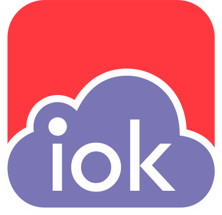

  

#  :blue_book: IOK Documentation

## Contribute to write documentation for iokloud service.

Welcome to the IOK Documenntation. Interested in the Internet of things and how it can transform your business? Here you can find or share your idea about IoT services which you may keep in your mind. You can contribute in writting initial documents to add wish list. This will help you to understand the cloud service targets for IoT and to design it in an effective manner. 

As these devices start to become connected, we need a place to send, store, and process all of the information. Setting up your own in-house system isn’t practical anymore. The cost of maintaining, upgrading and securing a system is just too high, and there are some great services available. Indeed, we consider a cloud server as a service for IoT devices.

IOK Services enables secure, bi-directional communication between Internet-connected things (such as sensors, actuators, embedded devices, or smart appliances) and the cloud over MQTT and HTTP.

For contribution, please fork repository and pull request to add to the documments.
